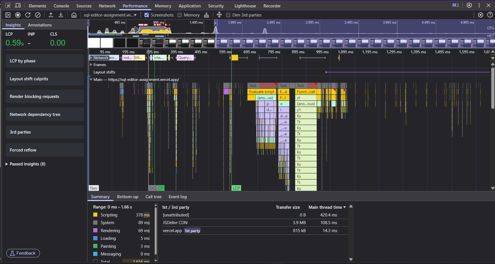
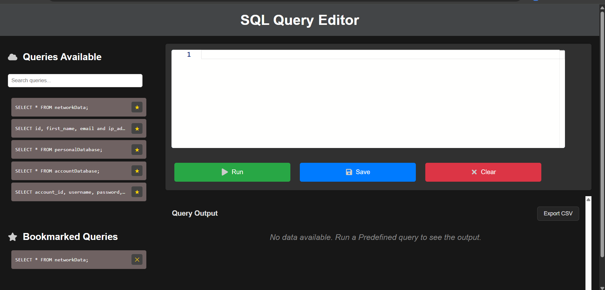
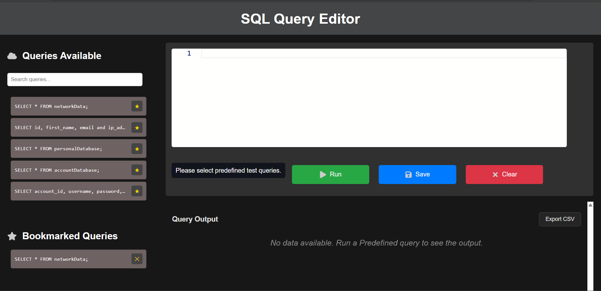
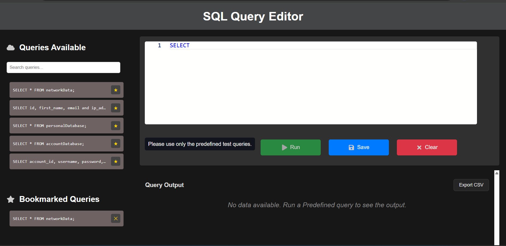
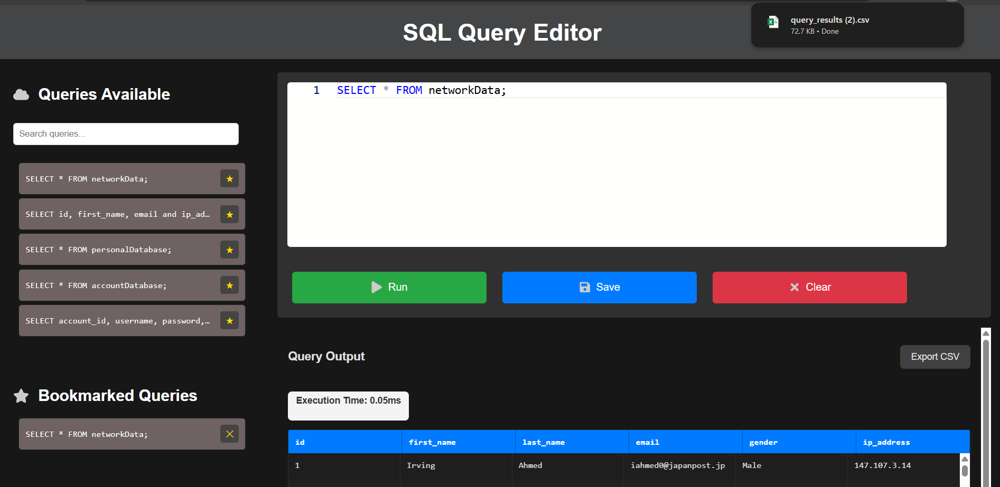

# 🧠 SQL Query Mock Editor

An intuitive **web-based SQL editor** that lets you write, run, and manage **predefined test queries** with instant results. Built with **React**, styled manually (no Tailwind), and powered by **Zustand** for efficient state management — this app is perfect for exploring SQL fundamentals in a simulated environment.

> 🚀 [Live Demo](https://sql-editor-assignment.vercel.app)

---

## ✨ Features

- 🔍 **Predefined Query Search** – Load example queries with one click  
- 💻 **Monaco Editor** – Rich code editing experience (syntax highlight, autocomplete)  
- 💾 **Bookmark Queries** – Save your favorite queries locally  
- 🧹 **Clear / Reset Query** – Instantly wipe the editor  
- ⌨️ **Keyboard Shortcuts** – Faster interaction (Ctrl+Enter to run)  
- 🪄 **Lightweight Table Rendering** – Efficient display of large query results    

---

## ⚙️ Tech Stack

| Tech              | Description                                |
|-------------------|--------------------------------------------|
| 🧩 React + Vite   | Fast bundling, dev experience              |
| 🧠 Zustand         | Lightweight global state manager           |
| 🧑‍💻 Monaco Editor | Rich text editor for SQL queries           |
| 🧪 JavaScript     | Core language                              |
| 🎨 CSS            | Manually styled (Tailwind not used)       |

---

## 📦 Plugins & Libraries Used

- [`@monaco-editor/react`](https://www.npmjs.com/package/@monaco-editor/react) – Monaco Editor wrapper for React  
- [`zustand`](https://www.npmjs.com/package/zustand) – Simplified state management  
- [`react-window`](https://www.npmjs.com/package/react-window) – Lightweight, efficient rendering for large lists/tables   
- `vite` – Fast dev server and bundler  

---

## 🚀 Performance Snapshot

- **Initial Page Load Time:** ~1.7 seconds  
- **Measured Using:** Chrome DevTools → Lighthouse Audit  
 

### 📷 Screenshots

| Description                                         | Screenshot Preview |
|-----------------------------------------------------|--------------------|
| Lighthouse Report                                   |  |
| Load Performance Graph                              |  |
| Homepage Overview                                   |  |
| Empty Query Warning Message                         |  |
| Invalid Query (Not Predefined) Error Message        |  |
| Export CSV Option Available                         |  |


---

## 🧠 Optimizations Implemented

- ✅ Lazy-loaded Monaco Editor  
- ✅ Responsive font sizing for better rendering on smaller screens  
- ✅ Avoided unnecessary re-renders with Zustand slices  
- ✅ Used `localStorage` to persist bookmarks without re-fetching  
- ✅ Used `react-window` to handle large dataset rendering efficiently  

---

## 🛠 Local Setup

```bash
# 1. Clone the project
git clone https://github.com/Lakshya044/Sql_Editor_Assignment.git
cd Sql_Editor_Assignment


# 2. Install dependencies
npm install

# 3. Start development server
npm run dev
```

Access it at: [http://localhost:5173](http://localhost:5173)

---

## 📉 Notes

- You can only run predefined test queries listed in the sidebar.  
- All queries and bookmarks are saved locally in your browser.  
- This is a mock environment – no actual database is used.  

---

## 🙌 Thank You for Visiting!

Crafted with passion and precision by **Lakshya Parashar** 🚀  
_Explore. Learn. Query. Repeat._ 💡